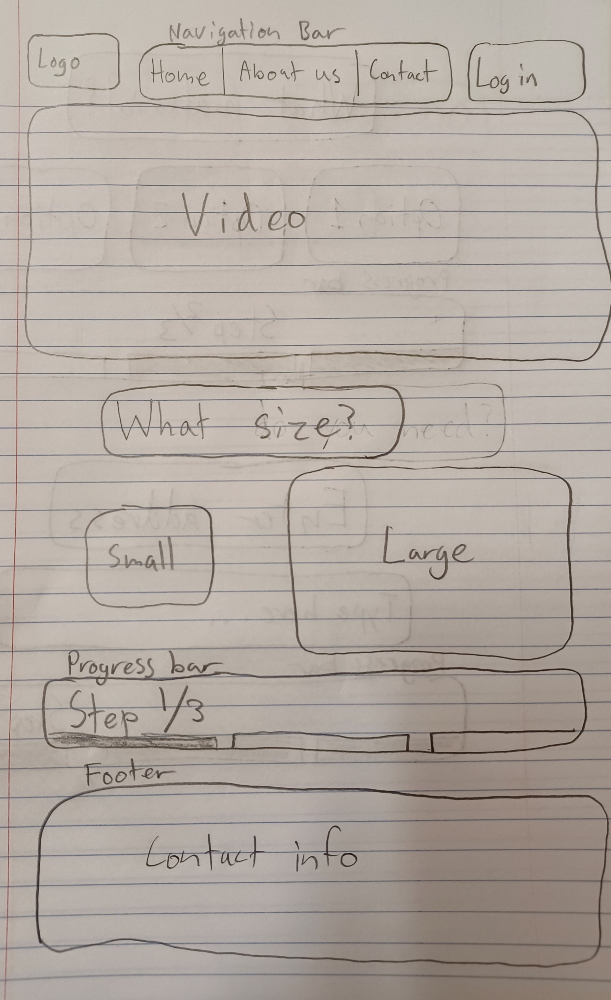
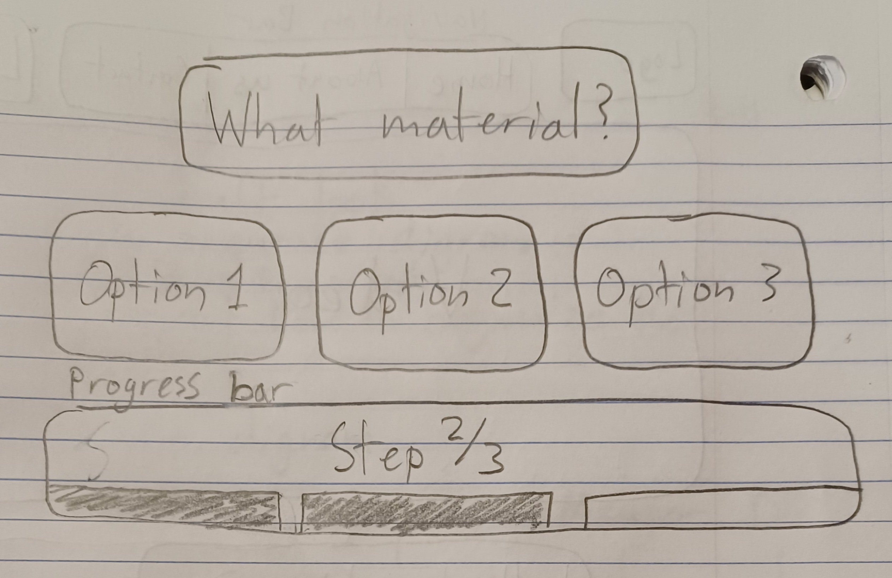
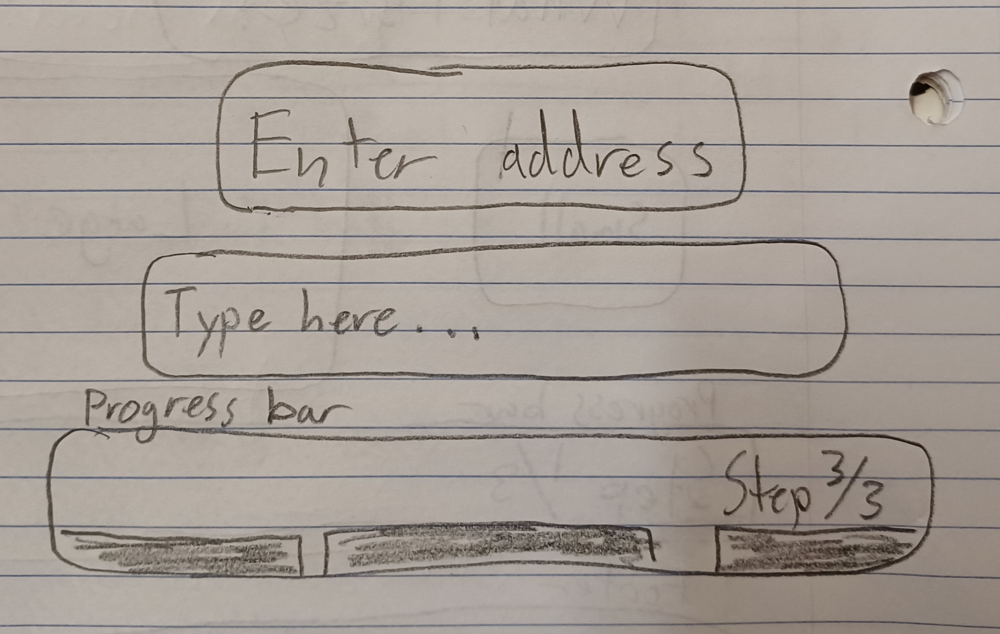
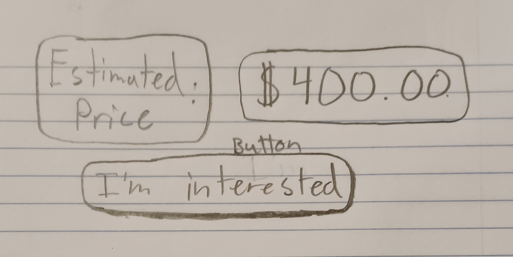
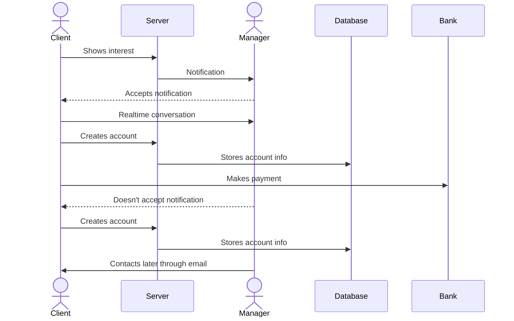

# Green Dumpster Co.

[My Notes](notes.md)

This repository contains the resourses for the development of a full stack website for a small business called Green Dumpster. It's purpose is going to allow users to enter on the site and rent a real large metal dumpster and have it delivered at the time the user discusses with the company. The website, when finished, will look professional, have the capability to make purchases, and converse with a manager in a real time chat to negotiate a delivery time.

> [!NOTE]
>  This is a template for your startup application. You must modify this `README.md` file for each phase of your development. You only need to fill in the section for each deliverable when that deliverable is submitted in Canvas. Without completing the section for a deliverable, the TA will not know what to look for when grading your submission. Feel free to add additional information to each deliverable description, but make sure you at least have the list of rubric items and a description of what you did for each item.

> [!NOTE]
>  If you are not familiar with Markdown then you should review the [documentation](https://docs.github.com/en/get-started/writing-on-github/getting-started-with-writing-and-formatting-on-github/basic-writing-and-formatting-syntax) before continuing.

## 🚀 Specification Deliverable

> [!NOTE]
>  Fill in this sections as the submission artifact for this deliverable. You can refer to this [example](https://github.com/webprogramming260/startup-example/blob/main/README.md) for inspiration.

For this deliverable I did the following. I checked the box `[x]` and added a description for things I completed.

- [X] Proper use of Markdown
- [X] A concise and compelling elevator pitch
- [X] Description of key features
- [X] Description of how you will use each technology
- [X] One or more rough sketches of your application. Images must be embedded in this file using Markdown image references.

### Elevator pitch

Still putting off that home project that always becomes “next year’s” task? Let us help you lighten the load—literally. We take care of the waste management so you can focus on the transformation. Our exceptional customer service makes the process smooth from start to finish. Just ask your neighbors who use our service—they consistently tell us how much they appreciate the reliability and ease we provide.

Ready to get started? Visit our professional webpage to choose the right dumpster size and speak directly with a manager about the best delivery time for your project.

### UI

The first image is the look of the home page. It's followed by three other images which represent UI elements that would appear upon completing previous steps. Each new UI element/step would appear above the footer upon the completion of the previous step. This is done for simplicity.

### Sequence Diagram

### Key features

- Simplistic design that helps the user select the perfect dumpster
- Animated windows that open as the user makes clarifying decisions 
- Ability to chat with a manager
- If the manager isn't online an email will be sent to them
- If the manager can't get online quickly, the user is prompted to create an account
- The account allows the managers to contact the customer at a later time
- If the customer is ready to make a purchase they can through the website

### Technologies

I am going to use the required technologies in the following ways.

- **HTML** - Used in the layout of the website, which will constitute mostly one page for simlicity. There will also be an account page with payment information.
- **CSS** - Used for carfully selected colors, fonts, and screen sizing capabilities.
- **React** - Used for annimated windows allong with chat/account creation calls made to the server
- **Service**
    - Chat
    - Account creation
    - Payment
- **DB/Login** - Stores information about the user, their purchase, and chat history.
- **WebSocket** - Provides capabilities for the live chat.

## 🚀 AWS deliverable

For this deliverable I did the following. I checked the box `[x]` and added a description for things I completed.

- [x] **Server deployed and accessible with custom domain name** - [My server link](https://greendumpster.click).

## 🚀 HTML deliverable

For this deliverable I did the following. I checked the box `[x]` and added a description for things I completed.

- [x] **HTML pages** - I created `index.html` as the home page, `login.html` as the login page, `chat.html` as the chat page.
- [x] **Proper HTML element usage** - I used `<header>`, `<nav>`, `<main>`, and `<footer>` to organise the elements on the page
- [x] **Links** - I created links in the `<nav>` element to other pages, also to my GitHub page in the `<footer>`.
- [x] **Text** - There are instances where I use `
` and `` to convey text.
- [x] **3rd party API placeholder** - I created a text block on the home page as a placeholder.
- [x] **Images** - There is a video and some dumpster images on the home page.
- [x] **Login placeholder** - On the login page there is a `<form>` element to enter your email and password.
- [x] **DB data placeholder** - On the login page under the `<form>` there is a placeholder for the username and the database contents with the order history of the user.
- [x] **WebSocket placeholder** - I created a text block on the chat page as a placeholder.

## 🚀 CSS deliverable

For this deliverable I did the following. I checked the box `[x]` and added a description for things I completed.

- [x] **Header, footer, and main content body** - I implemented basic styles to header, main, and footer.
- [x] **Navigation elements** - I implemented basic styles to the nav.
- [x] **Responsive to window resizing** - I payed attention to making sure that elements were in flex boxes to size well.
- [x] **Application elements** - I made sure that the elements were colored and spaced in an easy to see manner for different sizes.
- [x] **Application text content** - I made sure that the text was colored and had a readable font.
- [x] **Application images** - I made sure that the images sized apropriately for different screen sizes.

## 🚀 React part 1: Routing deliverable

For this deliverable I did the following. I checked the box `[x]` and added a description for things I completed.

- [x] **Bundled using Vite** - I set up Vite as the development server.
- [x] **Components** - I created `App`, `Home`, `Login`, and `Chat` components for navigation without refreshing.
- [x] **Router** - I propperly set up routes using `react-router-dom` so that the URL changes with navigation and can be easily returned to.

## 🚀 React part 2: Reactivity deliverable

For this deliverable I did the following. I checked the box `[x]` and added a description for things I completed.

- [x] **All functionality implemented or mocked out** - I made flow and login/logout much more streamline. I also added the ability to display sent messages. Messages and login information are saved to local storage.
- [x] **Hooks** - I used the `useState` hook to establish app wise state that could be accessed by several components. I also used the `useEvent` hook to have manager messages send automatically every 3 seconds.

## 🚀 Service deliverable

For this deliverable I did the following. I checked the box `[x]` and added a description for things I completed.

- [x] **Node.js/Express HTTP service** - Done!
- [x] **Static middleware for frontend** - Done!
- [x] **Calls to third party endpoints** - Google maps on home page.
- [x] **Backend service endpoints** - Login and chat history endpoints implemented!
- [x] **Frontend calls service endpoints** - Done!
- [x] **Supports registration, login, logout, and restricted endpoint** - Complete, the restricted endpoint is the chat history endpoint. There isn't a way to access it throught the UI unless you are logged in, but it also verified that you are authorised to call the endpoint.

## 🚀 DB deliverable

For this deliverable I did the following. I checked the box `[x]` and added a description for things I completed.

- [x] **Stores data in MongoDB** - Complete! It stores chat history which contains infromation about previous purchases and deals.
- [x] **Stores credentials in MongoDB** - Complete!

## 🚀 WebSocket deliverable

For this deliverable I did the following. I checked the box `[x]` and added a description for things I completed.

- [ ] **Backend listens for WebSocket connection** - I did not complete this part of the deliverable.
- [ ] **Frontend makes WebSocket connection** - I did not complete this part of the deliverable.
- [ ] **Data sent over WebSocket connection** - I did not complete this part of the deliverable.
- [ ] **WebSocket data displayed** - I did not complete this part of the deliverable.
- [ ] **Application is fully functional** - I did not complete this part of the deliverable.
